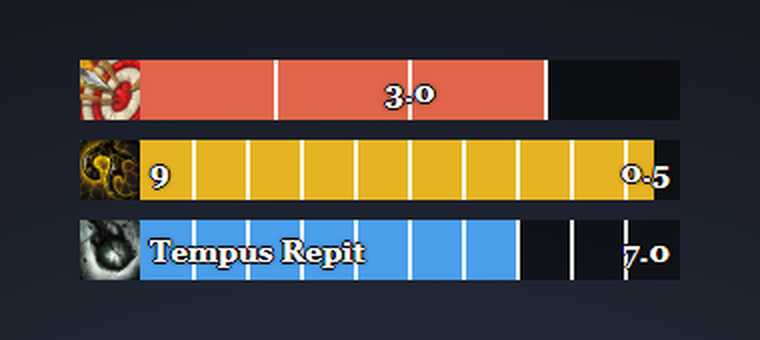

# Wa — WeakAuras Proc Trackers

Source and import strings for **[Kende] Proc Trackers**, a WeakAuras package for World of Warcraft: Mists of Pandaria Classic that tracks three trinket/gem procs so you can time DoT snapshots and cooldown windows precisely:

- **Black Blood of Y'Shaarj** — Intellect stacking buff, with a gold snapshot window at 9+ stacks.
- **Sinister Primal Diamond** — flat +30% spell haste proc.
- **Unerring Vision of Lei Shen** — flat +100% crit proc.

All three bars share one dynamic group: only active procs are shown, auto-stacked with no gaps.

## Files

| File | What it is |
|---|---|
| `BlackBlood-YShaarj.txt` | The `!WA:2!...` import string — paste into WeakAuras' Import dialog in-game. |
| `BlackBlood-YShaarj.aura.lua` | The Lua source table the import string is generated from. |
| `wago-description.md` | Full description for the wago.io listing. |
| `patch-notes.md` | Short changelog text for wago.io version updates. |
| `assets/preview.png` | Screenshot used above, generated from `mockup-black-blood.html`. |
| `mockup-black-blood.html` | Standalone interactive mockup: drag/resize each bar, preview colors, and simulate procs in a browser (open the file directly, no server needed). |

## Regenerating the import string

The import string is built (not written by hand) using the real `LibSerialize` + `LibDeflate` libraries running in a Lua 5.1 interpreter, so it's byte-for-byte compatible with what WeakAuras itself would produce. Any edit goes through `BlackBlood-YShaarj.aura.lua`, then gets re-encoded and round-trip verified before being copied into `BlackBlood-YShaarj.txt`.
